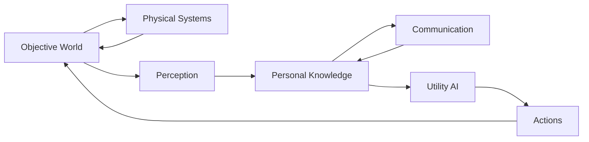

# ss13-ecs-sim

An SS13-inspired station simulation research project built around an
Entity Component System (`tcod-ecs`). This is a simulation and research
platform, not (yet) a playable game.

The project investigates emergent crew behavior produced by the
interaction of:

- physical station systems and room-level atmosphere
- crew health and hypoxia
- **limited perception** and **subjective knowledge**
- radio communication and communication failure
- personality traits and occupational competence
- utility-based AI
- deterministic, reproducible simulation runs
- post-run experiment analysis

The first research question:

> Can a deterministic station simulation produce believable and
> divergent crew responses to an environmental emergency — here, a
> Maintenance hull breach — without scripting the outcome?

## The central rule

> **The world has objective state, but crew members act on subjective
> knowledge of that state.**

Crew AI may never query arbitrary world state. Everything an actor
knows entered through **perception** (room-local direct observation) or
**communication** (radio reports, which create *derived*,
lower-confidence beliefs with provenance links). The omniscient event
log exists only for debugging and analysis — it never feeds crew
knowledge.



Physical systems (atmosphere, health) may read objective state —
breathing depends on the *real* atmosphere. Cognitive systems
(perception, communication, utility AI) must respect information
boundaries. This is enforced by permanent tests, not convention (see
[Testing](#testing)).

Information may only change physics through the chain
`information → decision → action → physics`, never directly. That
causal boundary is also guarded by a test.

## Why tcod-ecs

`tcod-ecs==5.5.0` provides entities, components, tags, and — critically
— first-class **relationships** (`LOCATED_IN`, `BELIEVES`, `SOURCE`,
`DERIVED_FROM`, ...), which are the backbone of the knowledge model.

The domain never calls raw tcod-ecs APIs outside `ecs/`. A thin set of
semantic helpers (`move_entity`, `give_belief`, `belief_value`,
`radio_owned_by`, ...) keeps a future migration to Esper or another ECS
possible. This is deliberately *not* a generic ECS abstraction
framework — just readable, invariant-holding operations.

## Installation

Requires Python ≥ 3.11.

```bash
git clone https://github.com/yakuzadave/ss13-ecs-sim.git
cd ss13-ecs-sim
pip install -e '.[dev]'      # or: uv venv && uv pip install -e '.[dev]'
```

Pinned core dependency: `tcod-ecs==5.5.0`. The only other runtime
dependency is `pandas`, and it is used exclusively in the experiment
layer — never in the simulation core.

## Quickstart

### Run the tests

```bash
pytest
```

### Run the decompression experiment

```python
from station_sim.experiments.runner import run_decompression_experiment
from station_sim.experiments.comparison import compare_runs

on = run_decompression_experiment(seed=82741, comms_enabled=True, ticks=40)
off = run_decompression_experiment(seed=82741, comms_enabled=False, ticks=40)
print(compare_runs(on, off))
```

Same station, same crew, same incident, same seed — only radio
availability differs. Typical output:

| metric | comms on | comms off |
|---|---|---|
| crew_injured | 0 | 2 |
| radio_messages | 1 | 0 |
| crew_aware_of_incident | 5 | 2 |
| first_broadcast_tick | 13 | — |
| incident_contained_tick | 16 | — |
| maintenance_min_pressure | 1.64 kPa | 4.44 kPa |

With comms on, Patel observes the breach, radios a single
"Maintenance pressure is LOW" report, informed crew close the door, and
nobody is hurt. With comms off, the warning never propagates and crew
in/near Maintenance take hypoxia damage.

### Paired multi-seed sweep

Every seed runs comms ON and comms OFF against identical initial
conditions, so outcome differences are attributable to communication
rather than initial randomness. The seed controls personality jitter
and breach severity; each seed is exactly reproducible.

```python
from station_sim.experiments.comparison import run_paired_sweep

sweep = run_paired_sweep(range(100), ticks=40)
print(sweep.groupby("comms_enabled")[
    ["crew_injured", "crew_aware_of_incident", "maintenance_min_pressure"]
].mean())
```

### Knowledge propagation timeline

```python
from station_sim.experiments.comparison import knowledge_timeline, knowledge_timeline_grid

print(knowledge_timeline(on))
#    crew  first_aware_tick        learned_via
#   Chen              12.0       radio_report
#     Lin              12.0       radio_report
#  Morgan              12.0       radio_report
#   Patel              14.0  direct_observation
#  Rivera              12.0       radio_report
```

### Kaggle notebook

`notebooks/01_decompression_experiment.ipynb` runs the full vertical
slice: world construction, breach injection, event log, pressure/crew/
knowledge tables, comms comparison, paired sweep, and the knowledge
timeline. It imports the installed package — no simulation code lives
in notebook cells. On Kaggle:

```python
!pip install tcod-ecs==5.5.0 pandas
```

then clone this repo and `pip install -e .` (or add `src/` to
`sys.path`; the first notebook cell shows how).

## How it works

### Station

Seven rooms connected by door entities:

```text
          Bridge
             |
         Central Hall
         /    |     \
    Medbay  Security  Engineering
                         |
                    Maintenance
                         |
                       Cargo
```

Doors are entities with a `DoorState` component and `SIDE_A` / `SIDE_B`
relationships. Adjacency is derived from those relationships — there is
no separate connectivity graph per system. Atmosphere operates at room
granularity (pressure only, for now).

### Crew

One security officer, two engineers, one doctor, one assistant, with
explicit baseline personalities (bravery, duty, empathy, curiosity,
self-preservation) and competences (engineering, medical, security).
The world seed applies small deterministic jitter so sweeps explore
variation while every seed stays reproducible.

### Tick order

The simulation runner owns execution order explicitly; systems never
call each other:

```python
atmosphere_system(world)   # physical: breaches, door equalization
health_system(world)       # physical: hypoxia from REAL atmosphere
perception_system(world)   # cognitive: observation -> beliefs
knowledge_system(world)    # (placeholder: decay/inference hook)
utility_ai_system(world)   # cognitive: beliefs -> scored actions
action_system(world)       # executes pending action entities
advance clock
```

### The knowledge model

Knowledge is made of **Fact entities**, not booleans:

```text
Fact
  predicate        = "room_pressure_kpa"
  value            = 61.3
  confidence       = 0.99
  source_kind      = "direct_observation"   # or "radio_report", ...
  observed_tick    = 14
  SUBJECT       -> Maintenance
  SOURCE        -> Patel          (for reported facts)
  DERIVED_FROM  -> Fact A         (information lineage)

Patel
  BELIEVES -> Fact
```

A radio report creates a **new derived fact** for each eligible
receiver — lower confidence (`× 0.85`), `source_kind = radio_report`,
and provenance links to the sender and the original fact. Nobody ever
shares the sender's belief entity, and there is no `everyone_knows()`
shortcut. Eligibility requires: sender conscious, sender's radio
powered, receiver's radio powered, matching channel.

### Report deduplication

Crew do not radio one message per 0.4 kPa change. Pressure beliefs are
classified into semantic states — `NORMAL / LOW / CRITICAL / VACUUM` —
and each crew member tracks what they last reported per subject. A
report happens only on a **state transition**:

```text
tick 13   Maintenance LOW        → REPORT
tick 14   Maintenance LOW        → suppressed
tick 18   Maintenance CRITICAL   → REPORT (escalation)
tick 24   Maintenance NORMAL     → REPORT (hazard clearing)
```

Reports originate from direct observation only — relaying second-hand
radio states would spam the channel with duplicates everyone already
received. Consequence: if the only observer dies, the warning dies
with them.

### Belief precedence

When one actor holds conflicting facts about the same
(subject, predicate), the operative belief is chosen deterministically:

1. newest observation wins
2. if ticks equal, higher source priority wins
   (`direct_observation` > `system_alarm` > `radio_report`)
3. if source equal, highest confidence wins
4. final tie-break by fact sequence ID

### Utility AI

Each tick, every conscious crew member scores candidate actions from
**beliefs + personality + competence + health + location** — never
objective state:

```text
evacuate        personal danger, self-preservation, bravery, duty
close_door      urgency, duty, engineering competence, bravery
report_hazard   urgency, duty, empathy (only on state transitions)
investigate     curiosity, duty, bravery vs self-preservation
idle            small baseline
```

Every score keeps its per-term contributions, so decisions are
explainable from the event log:

```text
[13] Chen selects close_door (utility=0.31, terms={
  'base_urgency': 0.20, 'duty': 0.24, 'engineering_competence': 0.27,
  'bravery': 0.11, 'personal_danger': -0.08, 'self_preservation': -0.09})
```

Actions are entities (`pending → completed/failed`) linked
`PERFORMED_BY` the actor and `TARGETS` to doors/rooms — intentionally
observable rather than optimized.

### Determinism

- Every run takes a seed; the world owns the only `random.Random`.
- tcod-ecs anonymous entity UIDs are `object()` — unique but not
  reproducible — so transient entities (facts, actions) get
  **deterministic sequence IDs** (`fact.0042`, `action.0007`) from a
  world-owned counter. Identical seeds produce identical, diffable IDs.
- All order-sensitive iteration (crew, actions, doors, belief
  tie-breaks) is explicitly sorted — never query-iteration order.
- Determinism is tested across fresh processes (different hash seeds).

## Project layout

```text
src/station_sim/
├── domain/            # pure data, no logic
│   ├── components.py  #   dataclasses + PressureState + precedence tables
│   ├── tags.py        #   categorical constants (CREW, ROOM, FACT, ...)
│   └── relations.py   #   relationship keys (LOCATED_IN, BELIEVES, ...)
├── ecs/               # the only tcod-ecs-coupled layer
│   ├── world.py       #   world + global state, deterministic IDs, event log
│   ├── helpers.py     #   thin semantic operations (move_entity, belief_value)
│   └── queries.py     #   common world queries
├── systems/           # stateless system functions
│   ├── atmosphere.py  #   physical
│   ├── health.py      #   physical
│   ├── perception.py  #   cognitive: world -> beliefs
│   ├── knowledge.py   #   belief inspection; decay/inference hook
│   ├── communication.py  # radios, report dedup, derived facts
│   ├── utility_ai.py  #   explainable scoring
│   ├── actions.py     #   action entity execution
│   └── logging.py     #   omniscient log access
├── scenarios/
│   └── decompression.py  # station + crew + breach incident
├── experiments/       # Pandas lives here, never in the core
│   ├── runner.py      #   ExperimentResult, per-tick metrics
│   └── comparison.py  #   sweeps, timelines, DataFrames
└── simulation.py      # explicit tick ordering

tests/                 # 40 behavior-oriented tests
notebooks/             # Kaggle-ready vertical slice
```

## Testing

```bash
pytest                 # 40 tests
```

Behavior-oriented tests over implementation tests. The permanently
load-bearing ones:

- **Anti-omniscience** (`test_utility_ai.py`): Lin, in Security with no
  observation or communication, must not react to a Maintenance breach.
  After a radio report, Lin *knows* but can't reach it; Chen, adjacent
  and previously idle, acts on the same broadcast.
- **Contradictory belief** (`test_utility_ai.py`): with objective
  pressure lethal but an injected "safe" belief, the AI must act on the
  belief — proving it reads knowledge, not atmosphere.
- **Information ⇎ physics** (`test_information_v02.py`): with AI
  disabled, comms ON and OFF produce bit-identical atmospheres.
  Information may change physics only through decisions and actions.
- **Determinism**: same seed → identical event logs, pressures, and
  transient entity IDs, verified across fresh processes.
- **Report dedup**: reports fire on semantic state transitions only;
  small kPa drift is suppressed.

## Current limitations

- Room-granularity atmosphere only (pressure is the only meaningful
  variable; no gas species, temperature diffusion, or fire).
- Perception is room-local only; no hearing, line of sight, or alarms.
- Utility AI re-decides every tick and has no memory of past decisions
  (other than the radio report memory).
- Reports originate only from direct observation; nobody relays
  second-hand information, so a dead observer means no warning.
- Beliefs never decay; conflicting beliefs resolve by a fixed
  precedence rule rather than reasoning about contradiction.
- Common-channel broadcast means remote awareness arrives in one tick
  for everyone; there is no channel structure or telecom geometry yet.
- The omniscient log is a plain list of strings.

## Roadmap

Deliberately out of scope for now, in rough order of interest:

1. **Telecom geometry** — channels, a relay entity, dead zones; makes
   the knowledge timeline a real measurement instead of a single wave.
2. **Physical evidence** — bodies, damaged doors, abandoned radios as
   sources of new facts; knowledge of the dead stops mattering except
   through evidence.
3. **Fact aging & misinformation** — stale beliefs, false reports,
   conflicting-knowledge experiments.
4. **Tile atmospherics & fire** — only once room-level experiments stop
   being interesting.
5. **GOAP / LLM-proposed intentions** — any planner stays strictly
   subordinate to the authoritative ECS: it proposes intentions, the
   simulation validates them into legal actions. An LLM may say
   "I should get Patel to Medbay"; it may never assert "Patel is now
   in Medbay."

Explicitly not planned for the near term: graphics, player controls,
combat, inventory, chemistry, antagonists, networking, persistence.

## Repository

Issues and progress tracking:
[github.com/yakuzadave/ss13-ecs-sim](https://github.com/yakuzadave/ss13-ecs-sim)
